# Active Choices Plug-in

[](https://plugins.jenkins.io/uno-choice)
[](https://github.com/jenkinsci/active-choices-plugin/blob/master/CHANGES.md)
[](https://plugins.jenkins.io/active-choices)
[](https://ci.jenkins.io/job/Plugins/job/active-choices-plugin/job/master/)
[](https://issues.jenkins.io/browse/JENKINS-64962?jql=component%20%3D%20%27active-choices-plugin%27%20AND%20resolution%20IS%20EMPTY%20ORDER%20BY%20updated%20DESC)

## Overview

The Active Choices plugin is used in parametrized freestyle Jenkins jobs to create **scripted, dynamic and interactive
job parameters**. Active Choices **parameters** can be **dynamically updated** and can be **rendered as combo-boxes,
check-boxes, radio-buttons or rich HTML UI widgets**.

Active Choices parameters are scripted using Groovy, or (optionally) Scriptler Groovy scripts. These custom scripts
support the use of the Jenkins Java API, system environment variables, global node properties, and potentially
external Java and Javascript libraries.

Once the plugin is installed, three new parameter types become available:

1. Active Choices Parameter
2. Active Choices Reactive Parameter
3. Active Choices Reactive Reference Parameter

> **_NOTE:_** The Reactive Reference Parameter allows for parameters to be displayed as
>formatted HTML. When configuring jobs with this feature, keep in mind how the parameter
will be rendered and whether it could be a security issue.

> **_NOTE:_** The plug-in was developed in a way that it relies heavily on the HTML/DOM
>of the Jenkins UI. We navigate the DOM using JavaScript to create the relationship and
>reactivity between parameters. Follow [JENKINS-63284](https://issues.jenkins-ci.org/browse/JENKINS-63284)
>for updates on a version that does not require the UI. When that issue is closed, the
>plug-in should work fine with Pipelines, DSL, timers, cron, REST-API-triggered jobs, etc.

Active Choices parameters allow users to select value(s) for a job
parameter. Parameter values can be:

- dynamically generated (using Groovy or a [Scriptler](https://wiki.jenkins-ci.org/display/JENKINS/Scriptler+Plugin)
script)
- dynamically updated based on other UI parameters
- multi-valued (can have more than one value)
- rendered with a variety of UI controls, including dynamic HTML (see NOTE above on the security risks)

We will introduce the Active Choices based UI controls by briefly describing their behavior and rendering
characteristics. We will then provide a guide to their configuration.

## Active Choices Parameter

### Behavior

- An Active Choices parameter dynamically generates a list of value options for a build parameter using a Groovy script
or a script from the Scriptler catalog.

### Rendering

- Active Choices parameters can be rendered as standard selection lists, check boxes and radio buttons.
- A text box filter can be optionally shown to aid in filtering the value options.

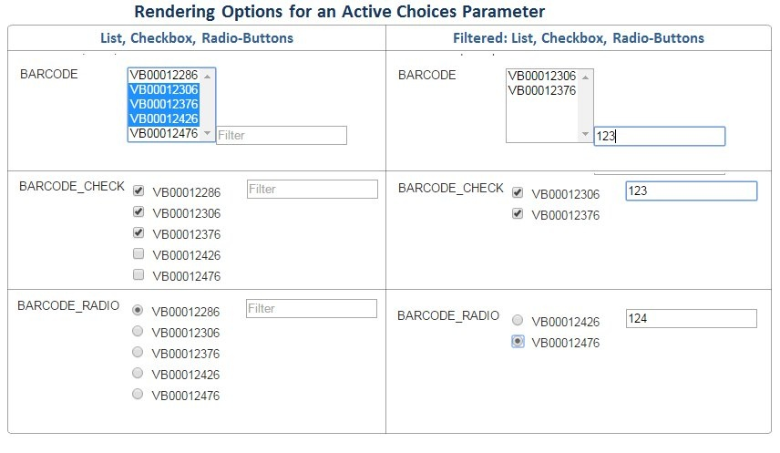

## Active Choices Reactive and Reactive Reference Parameters

Both of these parameters have additional useful behaviors and Reactive Reference has some unique rendering options.

### Behavior

Similar to Active Choices Parameter above:

- Active Choices Reactive and Reactive Reference parameters dynamically generate value options for a build parameter
using a Groovy script or a Scriptler script

Furthermore:

- Active Choices Reactive and Reactive Reference parameters can be **dynamically updated**(cascade update) when the
value of other job UI control(s) change(s)

### Rendering Options

#### Active Choices Reactive

- Active Choices Reactive parameters can be rendered as standard selection lists, check boxes and radio buttons.
- A text box filter can be optionally shown to aid in filtering the value options.

#### Active Choices Reactive Reference

Active Choices Reactive Reference parameters are used to enhance a Jenkins job form UI with reference information.

With this use case in mind, a Reactive Reference UI control can be rendered as:

- An HTML list (bulleted or numbered)
- An HTML input text box
- Dynamically generated HTML (image, iframe, etc.);

The dynamically generated HTML option, works with any well-formatted HTML returned by the Groovy script. It enables
rendering of a variety of HTML elements, including **pictures, inline-frames, hyperlinks, richly formatted text** etc.

In addition, Reactive Reference parameters can be **hidden** from the UI and thus provide the option of dynamically
generating hidden build parameters. These options are further discussed in the Reactive Reference configuration section.

### Rendering Example

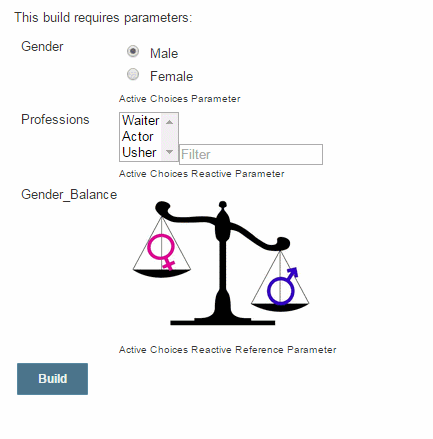

In the example above the value options for the 'Professions' parameter get updated when the 'Gender' parameter changes.

In addition, the Reactive Reference parameter 'Gender_Balance' rendered as a picture is also dynamically updated
when the 'Gender' parameter is updated.

### Behavior and Rendering Summary

The following table summarizes the behavior and rendering characteristics of the three Active Choices parameter types.

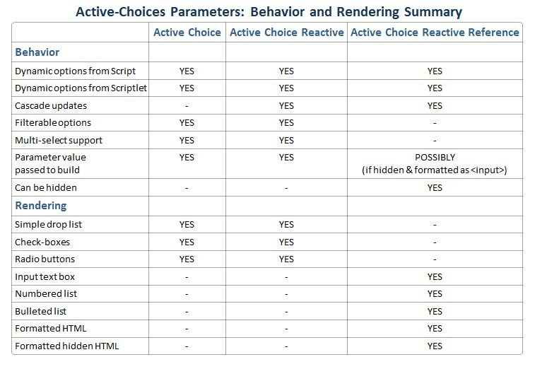

## Active Choices Parameter Type Configuration

The plug-in includes the following parameter types:

- Active Choices Parameter
- Active Choices Reactive Parameter
- Active Choices Reactive Reference Parameter

We now describe the details of their configuration.

### Active Choices Parameter: Configuration Options (Example 01)

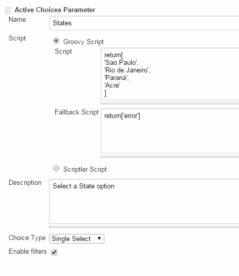

An Active Choices Parameter is configured by setting the following options in the parameter configuration

#### The 'Name' and 'Description'

These are the typical parameter Name and Description that are common to all Jenkins parameters

#### The 'Script'

The 'Script' is the **Groovy code or Scriptlet script** that will dynamically generate the parameter value options

- By selecting either of the two radio button options you can either type a Groovy script directly or use a
Scriptler script
- The script must return a **java.util.List**, an **Array** or a **java.util.Map**, as in the example below:

```groovy
return ['Option 1', 'Option 2', 'Option 3']
```

#### The 'Fallback Script'

The 'Fallback Script' configuration option provides alternate parameter value options in case the main Script fails
either by throwing an Exception, or by not return a `java.util.List`, `Array`, or `java.util.Map`.

#### The 'Choice Type'

The **'Choice Type**' option provides four different rendering options for the option values:

1. A list box where a single selection is allowed
2. A list box where multiple selections are allowed
3. A list of check boxes (multiple selections allowed)
4. A list of radio buttons (a single selection is allowed)

#### The 'Enable Filter'

The '**Enable Filter**' option will provide a text box filter in the UI control where a text filter can be typed.
Only value options that contain the text are then listed.

This filer is case independent.

### Active Choices Parameter Rendering (Example 01)

The 'Example 01' Active Choices parameter configuration generates the following build form UI control. The user can
select a single 'State' option from a filterable drop-down list.

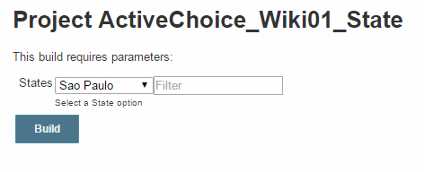

#### Making 'Default' selections

It is possible to have some of the options displayed in an Active Choices UI control selected by default when the
control is initialized.

You can **define the default value selections** by adding the suffix; **:selected** to the element you want to be
the default selection from those returned by the script. In the example below, we will make the State of 'Parana'
the default selection when the parameter UI control is rendered.

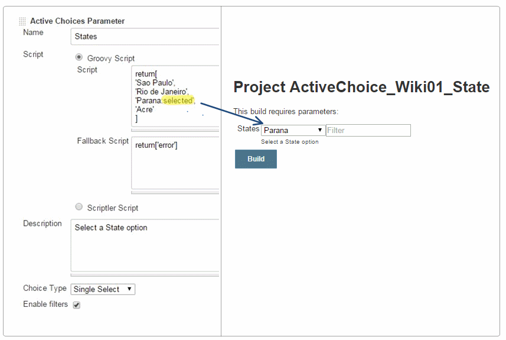

#### Making 'Disabled' selections

You also can **define disabled selections** by adding the suffix; **:disabled** to the element(s) you want to be
disabled. In the example below, we will make various elements to be disabled and immutable.

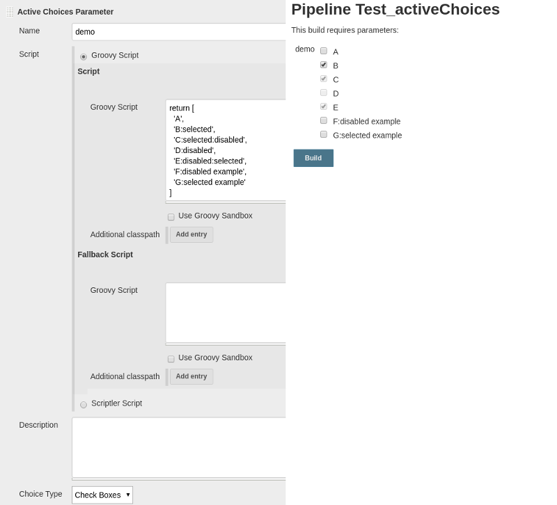

As you can see, both **:selected** and **:disabled** can be specified at the same time.

We credit the developers of the
[Dynamic Parameter plugin](https://wiki.jenkins-ci.org/display/JENKINS/Dynamic+Parameter+Plug-in) with some of the
initial concepts and code on which Active Choices was implemented. However, there are several important differences and
improvements between the Active Choices plugin and the original Dynamic Parameter plugin:

1. An Active Choices parameter can be **rendered** as a multi-select control (combo-box or check-box) allowing users
to **select more than one value** for the parameter
2. The parameter **options value list can be filtered**. If the "**Enable Filters**" option is checked, an extra input
box will be displayed allowing users to filter the options.
3. You can define a '**fallback**' behavior if the value generator script raises an exception.
4. You can define **default value selections**in the dynamically generated value list

### Active Choices Reactive Parameter: Configuration Options (Example 02)

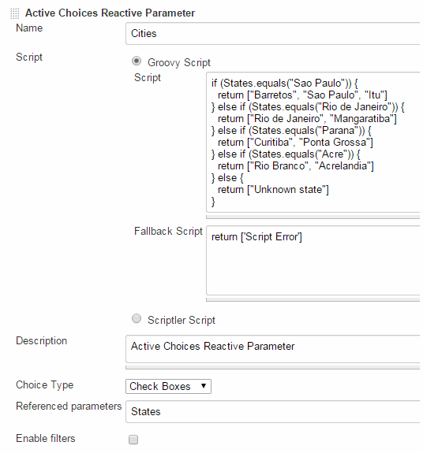

An Active Choices Reactive parameter is configured with a set of similar options as those shown above for the Active
Choices parameter. However, a Reactive parameter provides the additional '**Referenced parameters**' configuration
option.

- This option, takes a list of job parameters that trigger an **auto-refresh of the Reactive Parameter when any of the
'Referenced parameters' change**

#### The 'Referenced parameters'

The '**Referenced parameters**' text field contains **a list of comma separated parameter Names**(from the current job)
that will trigger a refresh of the Reactive Parameter when their values change. The values of these parameters are
passed to the script binding context before the script is re-executed to generate a new set of option values for the
Active Choices control.

### Active Choices Reactive Parameter Rendering (Example 02)

Let's examine a Jenkins build form rendered with Active Choices parameters that satisfies the following requirements.
The form:

- Allows users to select one of several Brazilian States
- Provides an additional control where a set of Cities belonging to the selected State is dynamically displayed
- Allows the user to select one or more of the displayed Cities

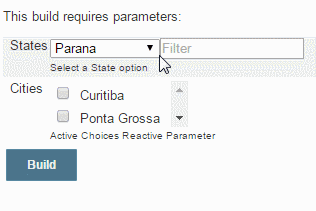

The job UI has two parameters:

#### 1) States: An Active Choices Parameter

The first parameter is the **'States'** Active Choices Parameter from 'Example 01'. It allows the user to select one of
several Brazilian States. We could have just as easily used a Jenkins Choice Parameter, but we use an Active Choice
parameter (as shown from Example 01). The Groovy script for this is:

```groovy
return [
    'Sao Paulo',
    'Rio de Janeiro',
    'Parana',
    'Acre'
]
```

#### 2) Cities: An Active Choices Reactive Parameter

The second parameter is the **'Cities'** Active Choices Reactive Parameter that **dynamically displays** a set of cities
belonging to the selected State and allows users to select multiple values. The 'Cities' parameter configuration is shown
above in 'Example 02'.

Note that:

- The 'Cities' Reactive parameter references the previously defined States parameter ('Referenced parameters'=States);
- The 'Choice Type' is set to 'Check Boxes'.This will allow the user to select one or more 'Cities' by selecting multiple
check boxes.
- A custom 'Groovy Script' will be used to generate the 'Cities' value options as shown below (the last list value
returned by the script)

```groovy
if (States == "Sao Paulo") {
  return ["Barretos", "Sao Paulo", "Itu"]
} else if (States == "Rio de Janeiro") {
  return ["Rio de Janeiro", "Mangaratiba"]
} else if (States == "Parana") {
  return ["Curitiba", "Ponta Grossa"]
} else if (States == "Acre") {
  return ["Rio Branco", "Acrelandia"]
} else {
  return ["Unknown state"]
}
```

Whenever the user changes the option of the States parameter, the 'Cities' parameter will get dynamically updated. Note
how that the **'States'** referenced parameter is in the script binding and can be used directly.

You can use a Reactive parameter type for things like displaying the list of Maven artifacts, given a group ID.

### Active Choices Reactive Reference Parameter: Configuration Options


A Reactive Reference parameter is configured with a set of similar options as those shown above for the Active Choices
Reactive parameter.

However, a **Reactive Reference parameter provides a unique set of rendering options** (see 'Choice Type').

- Input text box
- Numbered list
- Bullet items list
- Formatted HTML
- Formatted Hidden HTML

Given the wide variety of rendering options the Active Choices Groovy script must return the following types of
variables for each option:

| Choice Type     | Groovy Returns | Comment                                                                             |
|----------------------|----------------|------------------------------------------------------------------------------------------------------------------------------------------------------------------|
| Input text box    | String     | The return String appears in a simple text box                                                          |
| Numbered list    | List      | The return List displays as a numbered list                                                           |
| Bullet items list  | List      | The return List displays as a bulleted list                                                           |
| Formatted HTML    | String     | The return String must be well formatted HTML to display correctly. You can include any HTML tags here, e.g.: some <table\>, or a <form\> to another web site. |
| Formatted Hidden HTM | String     | The parameter won't be displayed in the UI                                                            |

A typical application of a Reactive Reference parameter is to dynamically display reference information that can be
used to guide the user in making an appropriate value selection of another job parameter.

By design, the values of Reactive Reference parameters are NOT passed to the build environment with one important
exception. When the choice type is set to **Formatted HTML** or **Formatted Hidden HTML** and the HTML is an 'input'
element the value can be passed to the build. See the 'Advanced Usage' section for additional instructions.

### Example Configuration: Active Choices Reactive Reference Parameter

Below we present 3 examples of Reactive References with different Choice Types and their corresponding renderings in
the Jenkins job UI.

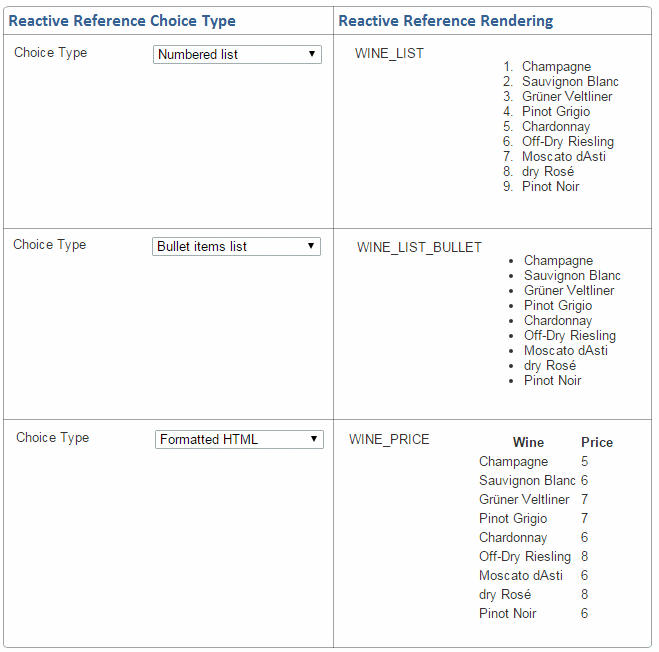

Consider an example where the user needs to make a meal selection that complements the available wine selection.
The food selection would be easier if some useful reference info could be offered when users considered a particular
wine. We call this reference information the 'WINE_RULE' and we can easily implement it using a Reactive Reference
parameter.

The 'WINE_RULE' gets automatically updated when a user makes a new selection from the 'WINE_MENU' (Note Referenced
parameters=WINE_MENU). As a result, when we make a 'WINE_MENU' selection we also get a 'WINE_RULE' that can guide the
'FOOD_MENU' selection.

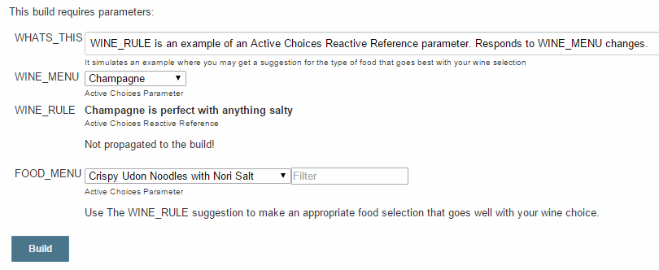

### Reactive Reference Configuration (Example 03)

The complete configuration of the 'WINE_RULE' parameter is shown below.

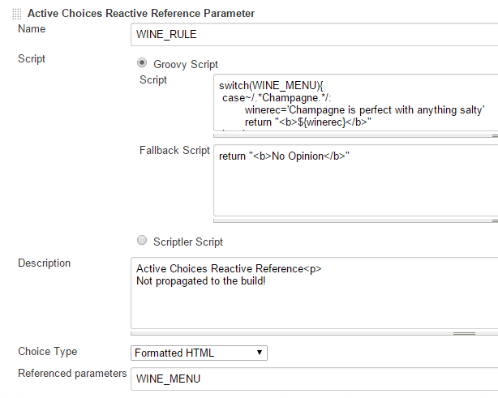

### Reactive Reference Groovy script (Example 03)

The groovy script that generates the 'WINE_RULE' **formatted HTML** for each of the choices is shown below.

```groovy
switch(WINE_MENU) {
  case ~/.*Champagne.*/:
    winerec='Champagne is perfect with anything salty'
    return "<b>${winerec}</b>"
  case ~/.*Sauvignon Blanc.*/:
    winerec='Sauvignon Blanc goes with tart dressings and sauces'
    return "<b>${winerec}</b>"
  case ~/.*Grüner Veltliner.*/:
    winerec='Choose Grüner Veltliner when a dish has lots of fresh herbs'
    return "<b>${winerec}</b>"
  case ~/.*Pinot Grigio.*/:
    winerec='Pinot Grigio pairs well with light fish dishes'
    return "<b>${winerec}</b>"
  case ~/.*Chardonnay.*/:
    winerec='Choose Chardonnay for fatty fish or fish in a rich sauce'
    return "<b>${winerec}</b>"
  case ~/.*Off-Dry Riesling.*/:
    winerec='Off-Dry Riesling pairs with sweet & spicy dishes'
    return "<b>${winerec}</b>"
  case ~/.*Moscato dAsti.*/:
    winerec='Moscato dAsti loves fruit desserts'
    return "<b>${winerec}</b>"
  case ~/.*dry Rosé.*/:
    winerec='Pair a dry Rosé with rich, cheesy dishes'
    return "<b>${winerec}</b>"
  case ~/.*Pinot Noir.*/:
    winerec='Pinot Noir is great for dishes with earthy flavors'
    return "<b>${winerec}</b>"
}
```

## Advanced Usage Notes

### Considerations while writing your Groovy script

Your Groovy script binding has access to two additional variables for use:

- `jenkinsProject` -> The Jenkins Project object
- `jenkinsBuild` -> The Jenkins Build object

### Passing Reactive Reference Values to the build

As was mentioned earlier, in general the values of reactive reference parameters are not passed to the build. However,
there are some scenarios where the ability to pass these values would be of interest. For a more extensive discussion
of this feature you can read
[here](https://github.com/biouno/uno-choice-plugin/wiki/Using-Uno-Choice-for-Dynamic-Input-Text-Box-Defaults).

#### Scenario 1: Pass a dynamically created value that can be edited by the user

In this scenario, we want to provide the user a dynamic default value that is also editable. This can be accomplished
with the following reactive reference configuration:

- Choice Type: **Formatted HTML**
- Groovy Script returning an **HTML input element** with the dynamic default value
- Advanced Option set to


#### Scenario 2: Pass a dynamically created value that is **hidden** (can't be edited by the user)

In this scenario, we want **the build to have access to a dynamic parameter generated from user input/option
selections** in the UI. The parameter is created programmatically, and is not user-editable. This can be accomplished
with the following reactive reference configuration:

- Choice Type: **Formatted Hidden HTML**
- Groovy Script returning an **HTML input element** with the dynamic default value
- Advanced Option set to


A 'Formatted Hidden HTML' Choice type is useful when you want to calculate values to use in the build, but these values
should not be modified by the user(e.g. to compute the deploy URL).

In both scenarios the groovy script must return an HTML element formatted as follows:

```groovy
return "<input name='value' value='${ReactiveRefParam}' class='setting-input' type='text'>"
```

**ReactiveRefParam** is the Reactive Reference value that will be passed to the build

#### Scenario 3: Create an input control with dynamic HTML and pass its value to the build

This is an interesting application of the Reactive Reference parameter. It allows you to create custom UI parameter
controls with improved interactivity. See
[example](https://wiki.jenkins-ci.org/display/JENKINS/Reactive+Reference+Dynamic+Parameter+Controls)

### Advanced Option: Omit Value Field

By default, 'Reactive References' pass to the build a hidden `<input name="value" value="">`. It means that your 'Reactive
Reference' parameter will always be empty, but you can use a 'Formatted HTML' parameter and instruct the plug-in to not
include this hidden value parameter.

You can click the 'Advanced' button and there you will find an option to omit the value field. This will you let you
define a value for the hidden parameter.

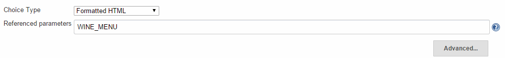

### Using Active Choices with Scriptler scripts

We assume users that need to use Scriptler generated parameters are already familiar with the Scriptler Plug-in. If
you need further information on how to use the Scriptler Plug-in, please refer to
[its Wiki page](https://wiki.jenkins-ci.org/display/JENKINS/Scriptler+Plugin) first.

Similar to a Groovy script, a Scriptler script is also written in Groovy and used to render the parameter. Your
Scriptler script must return a `java.util.List`, `Array`, or `java.util.Map` for Active Choices and Reactive
parameters, or custom HTML elements for the Reactive Reference parameter. Note that the value of other build parameters
(when using Scriptler in combination with Active Choices) will be available in the Scriptler script context. You do not
need to define such parameters in the Scriptler interface, or during the job definition.

However, **the main advantage that the Scriptler Plug-in** provides is the creation of a **reusable** **Groovy script
catalog** that can be used across multiple jobs or even for automation.

To make your Scriptler scripts reusable across multiple projects you should parameterize them and assign script
parameters using build parameters.

#### Example

`Environments.groovy` in Scriptler

```groovy
return ["Select:selected", "DEV", "TEST", "STAGE", "PROD"]
```

`HostsInEnv.groovy` in Scriptler

```groovy
// Static content examples. These lists can be generated dynamically as an alternative.
List devList  = ["Select:selected", "dev1", "dev2"]
List testList  = ["Select:selected", "test1", "test2", "test3"]
List stageList = ["Select:selected", "stage1"]
List prodList  = ["Select:selected", "prod1", "prod2", "prod3", "prod4"]

List default_item = ["None"]

if (Environment == 'DEV') {
  return devList
} else if (Environment == 'TEST') {
  return testList
} else if (Environment == 'STAGE') {
  return stageList
} else if (Environment == 'PROD') {
  return prodList
} else {
  return default_item
}
```

Pipeline in `Jenkinsfile`

```groovy
properties([
  parameters([
    [
      $class: 'ChoiceParameter',
      choiceType: 'PT_SINGLE_SELECT',
      name: 'Environment',
      script: [
        $class: 'ScriptlerScript',
        scriptlerScriptId:'Environments.groovy'
      ]
    ],
    [
      $class: 'CascadeChoiceParameter',
      choiceType: 'PT_SINGLE_SELECT',
      name: 'Host',
      referencedParameters: 'Environment',
      script: [
        $class: 'ScriptlerScript',
        scriptlerScriptId:'HostsInEnv.groovy',
        parameters: [
          [name:'Environment', value: '$Environment']
        ]
      ]
   ]
 ])
])

pipeline {
  agent any
  stages {
    stage('Build') {
      steps {
        echo "${params.Environment}"
        echo "${params.Host}"
      }
    }
  }
}
```

### Filter Supports Regular Expressions

Note that although the text 'Filter' box available for Active Choices parameters provides easy, case-insensitive
filtering by simply typing some text, it also supports more sophisticated filtering using regular expressions.

The following example shows such an example where a complex options list is filtered using a regular expression.
 
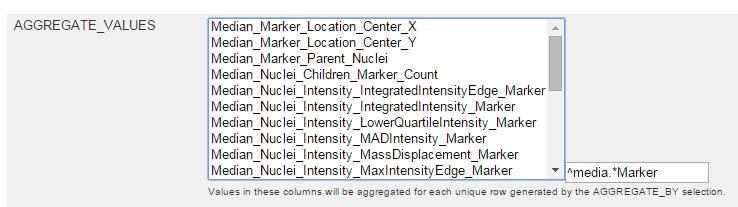

## Security

Active Choices versions before v2.0 may not be safe to use. Please review the following warnings before using an older
version:

- [Arbitrary code execution vulnerability](https://jenkins.io/security/advisory/2017-04-10/)
- [Stored cross-site scripting vulnerability](https://jenkins.io/security/advisory/2017-10-23/)

Starting with Active Choices v2.0, sandboxed Groovy scripts for Active Choices Reactive Reference Parameter will **no
longer emit HTML that is considered unsafe**, such as `<script>` tags. This may result in behavior changes on
*Build With Parameters* forms, such as missing elements. To resolve this issue, Groovy scripts emitting HTML will need
to be configured to run outside the script security sandbox, possibly requiring separate administrator approval in
*In-Process Script Approval*.

Active Choices will load two extra Javascript files, JQuery and `unochoice.js`.

## Languages Supported

1. English
2. Portuguese (Brazil)) *Work-In-Progress*
3. If you want to include your language, send us a pull request with the `messages.properties` files or get in touch!

## Known Limitations

1. The parameters are supposed to be handled only by humans, and at the moment do not work when the job is triggered
by plug-ins, API or scripts. Please see [this issue](https://issues.jenkins-ci.org/browse/JENKINS-28735) for more.
2. Before filing issues, please take a look at the
[Troubleshooting Page](https://wiki.jenkins.io/display/JENKINS/Troubleshooting)

## Release Notes

See the [CHANGES.md](https://github.com/jenkinsci/active-choices-plugin/blob/master/CHANGES.md) file.

## Sponsors

For commercial support, please get contact us via [@tupilabs](https://twitter.com/tupilabs).


For more about where the plug-in came from, check out the [BioUno project](http://biouno.org).


Get in touch if you would like to sponsor the development of the plug-in, or an open issue in JIRA.

## Other Resources

- “Dynamic and reactive parameterization in Jenkins pipelines using HTML, Groovy, and Bash” by _Esteban Echavarria Collazos_ - [link](https://medium.com/globant/dynamic-and-reactive-parameterization-in-jenkins-pipelines-using-html-groovy-and-bash-27b031fcd69b)

Check out a list of articles, tutorials, and publications at the [BioUno website](http://biouno.org/publications.html)

